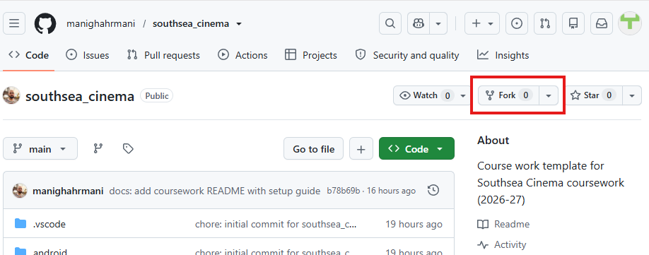
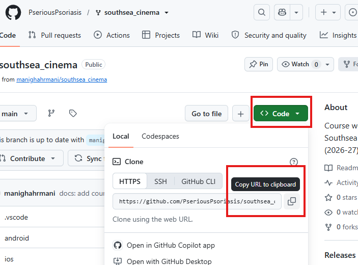
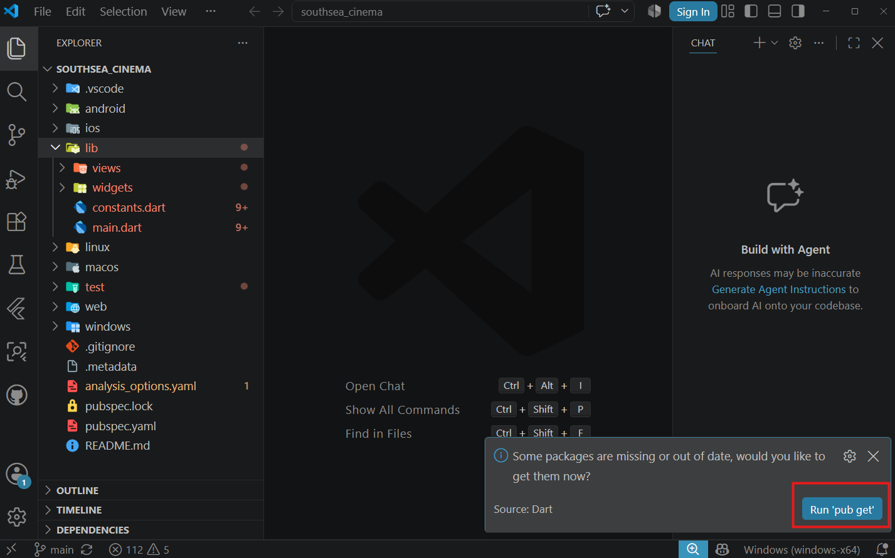
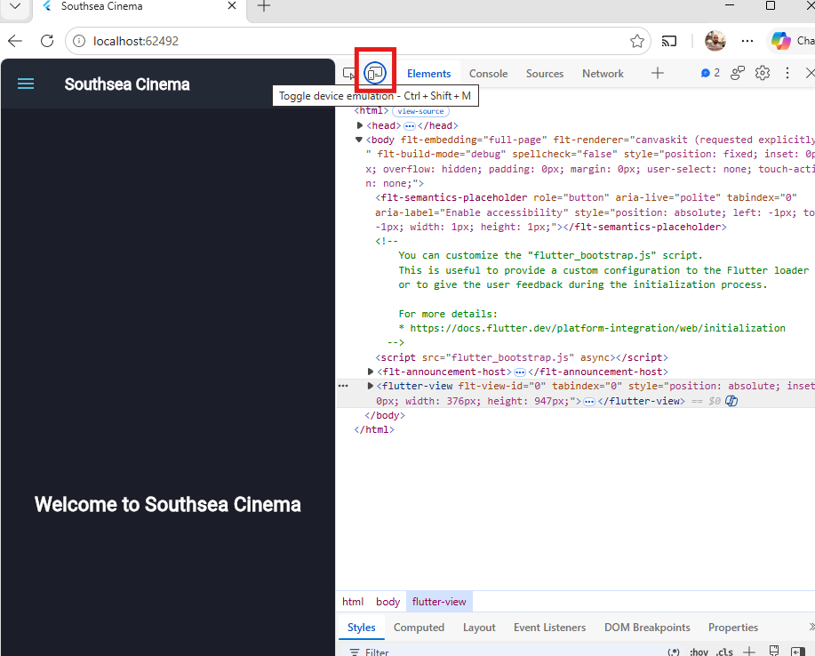
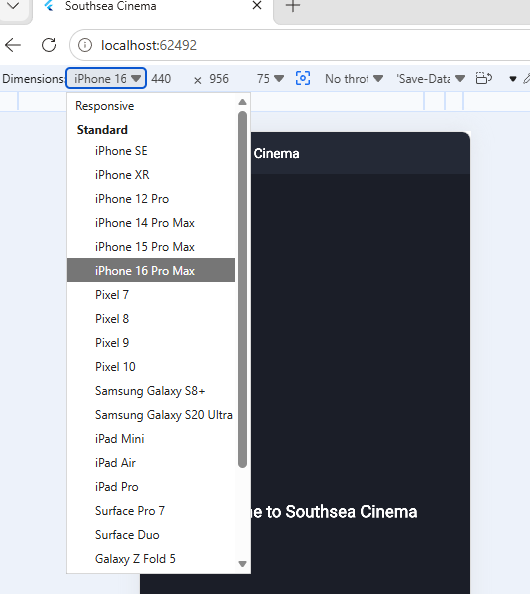

# Southsea Cinema - Flutter Coursework

This repository contains the coursework starter project for students enrolled in the **Programming Applications and Programming Languages (M30235)** and **User Experience Design and Implementation (M32605)** modules at the University of Portsmouth.

## Overview

Your task is to recreate a mobile-friendly version of the Southsea Cinema website using Flutter. You must begin by forking this starter repository, then build your own version of the app step by step as you work through the weekly worksheets.

Reference website: [Southsea Cinema](https://southseacinema.savoysystems.co.uk/SouthseaCinema.dll/)

The starter app is deliberately minimal. It contains only a basic theme, an empty home page, a small drawer, and a default widget test. You are expected to add screens, widgets, data models, tests, persistence, and cloud services during the coursework.

## Getting Started

### Prerequisites

You need:

- A GitHub account
- A way to edit and run Flutter projects
- Git installed and connected to your GitHub account

You have three development options:

1. GitHub Codespaces (browser-based, no local install required)
2. University Windows computers
3. Your own computer

The worksheets on the [Flutter Course homepage](https://manighahrmani.github.io/sandwich_shop/) explain these options in more detail.

### Fork the Repository

Open this repository on GitHub and click **Fork**, as shown below:

[https://github.com/manighahrmani/southsea_cinema/fork](https://github.com/manighahrmani/southsea_cinema/fork)



On the "Create a new fork" page, leave the default options as they are (do not change the repository name) and click **Create fork**:


Your fork should be called `southsea_cinema` and should have a URL like this:

```text
https://github.com/YOUR-USERNAME/southsea_cinema
```

### Clone Your Forked Repository

On your forked repository page, click the green **Code** button and copy the HTTPS URL, as shown below:



If you are using VS Code, open the Source Control panel and click **Clone Repository** (or open the Command Palette with `Ctrl+Shift+P` / `Cmd+Shift+P` and choose "Git: Clone"), then paste the URL you copied:


Alternatively, if you are using a terminal, run:

```bash
git clone https://github.com/YOUR-USERNAME/southsea_cinema.git
cd southsea_cinema
```

Replace `YOUR-USERNAME` with your GitHub username.

### Install Dependencies

When you open the project, VS Code may show a popup asking if you want to fetch missing packages. If you see it, click **Run 'pub get'**, as shown below:



If you do not see this popup, open a terminal and run the command manually:

```bash
flutter pub get
```

This downloads the Flutter packages needed by the starter app.


### Run the Application

This coursework targets Flutter Web. Use Chrome or Edge.

```bash
flutter run -d chrome
```

or:

```bash
flutter run -d edge
```

The app should open in your browser and show the Southsea Cinema starter home page, as shown below:


### Use Mobile View

The coursework should be designed mobile-first.

In Chrome or Edge:

1. Right-click the page and choose **Inspect**
2. Click the **Toggle device toolbar** button, highlighted below:



3. Choose a phone-sized device preset from the dropdown menu:



## Marking Criteria

This repository is the starting point for your Southsea Cinema coursework, which is **Item 1** of your module and worth **50% of the overall module mark**. Item 1 is assessed as a **portfolio**: you build the app in **five stages** and demonstrate each stage to a member of staff during your timetabled practical session.

There are **five demos**, but only your **best four count** towards Item 1, so you can miss (or do poorly on) one without harming your mark. Each demo is worth **25% of Item 1** (12.5% of the module) and is marked on three things:

- **Functionality (9% of Item 1)**: what your app can do by this point in the schedule
- **Quality (8% of Item 1)**: how well your code is organised
- **Understanding (8% of Item 1)**: whether you can answer two questions about your own work

Demos take place in your timetabled practical session, and **only one demo can happen per window**. If you miss a demo, you demonstrate the missed stage at the next window. Missing two demos caps Item 1 at **75%** (37.5% of the module), and so on.

📄 **For the full mark breakdown, the missed-demo rules, and how Extenuating Circumstances affect Item 1, read the [Assessment Guide](https://portdotacdotuk-my.sharepoint.com/:w:/g/personal/mani_ghahremani_port_ac_uk/IQC9nZoNwb2jT40MnFQPZWVvAVdTK2PGBmZ8jPff30RRyPc?e=w7Yrgi).** The full demo dates and requirements are listed on the [Flutter Course homepage](https://manighahrmani.github.io/sandwich_shop/).

## Submission

You will submit the link to your public forked repository on Moodle when instructed. You are not submitting a zip file or a copy of the source code.

Make sure your repository is public. Test this by opening your repository link in a private/incognito browser window.

## Demonstration

During each demo, you must be able to run your app and answer questions about your code.

Before attending a demo, check that the app runs from a clean clone:

```bash
flutter pub get
flutter run -d chrome
```

## Project Structure

The starter repository is intentionally small:

```text
southsea_cinema/
├── lib/
│   ├── constants.dart          # Shared colours, text styles, and app title
│   ├── main.dart               # Main app and route setup
│   ├── views/
│   │   └── home_view.dart      # Starter home page
│   └── widgets/
│       └── nav_drawer.dart     # Minimal starter drawer
├── test/
│   └── widget_test.dart        # Basic widget test
├── pubspec.yaml                # Project dependencies
└── README.md                   # This file
```

You will add more files and folders as the coursework develops.

## Help with Coursework

Use the worksheets on the [Flutter Course homepage](https://manighahrmani.github.io/sandwich_shop/) as your main guide.

To get support with this coursework, follow [discord_flutter.pptx](https://portdotacdotuk-my.sharepoint.com/:p:/g/personal/mani_ghahremani_port_ac_uk/IQCMJP6IiR_bQoYUMdXJSRDYAWnajEALZYEXFZyrJkHS1QU) and ask your question in the **Flutter** channel. Otherwise, attend your timetabled practical session and ask a member of staff for help.

If you get stuck:

- Ask for help in your practical session
- Post in the Flutter channel on Discord
- Check that your app still runs before making more changes
- Commit your work regularly with clear commit messages

Use AI tools carefully. You are allowed to use them, but you must understand, review, and adapt any generated code before adding it to your coursework.
